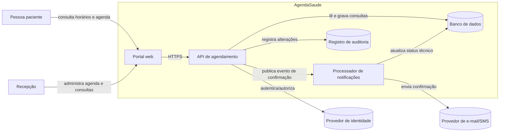
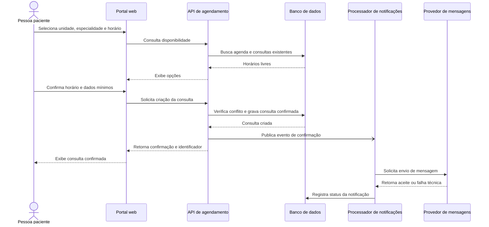

# AgendaSaude: discovery de arquitetura

> Exercício de documentação com a abordagem **diagrams as code**.

## 1. Sistema escolhido

O sistema escolhido é uma plataforma de agendamento de consultas para uma clínica de pequeno porte. A pessoa paciente consulta horários disponíveis, solicita um agendamento e recebe confirmação. A recepção também pode criar, remarcar ou cancelar consultas em nome da pessoa paciente.

O objetivo desta etapa não é definir a implementação completa, mas construir uma base de contexto que um agente de desenvolvimento possa consultar sem precisar inventar o contorno do sistema.

## 2. Descrição em linguagem natural

### Escopo

- cadastro e identificação de pacientes;
- cadastro de profissionais, especialidades e unidades;
- configuração de agendas e horários bloqueados;
- consulta de disponibilidade;
- criação, confirmação, remarcação e cancelamento de consultas;
- envio de notificações por e-mail ou SMS;
- visão operacional da agenda pela recepção;
- registro básico de auditoria das alterações.

### Nível da visão

Esta é uma visão de **containers**, inspirada no modelo C4. Ela mostra pessoas, sistemas externos e os principais blocos executáveis ou armazenáveis do produto. Não define classes, endpoints, tabelas ou infraestrutura de produção.

### Limites e responsabilidades

O **AgendaSaude** é responsável por regras de disponibilidade, conflitos de agenda, ciclo de vida do agendamento e autorização dos perfis paciente e recepção.

Ficam fora deste limite: prontuário clínico, cobrança, faturamento de convênios, telemedicina, prescrição, gestão de estoque e confirmação de identidade forte. Esses temas podem ser integrações futuras, mas não são decisões deste discovery.

### Integrações

- **Provedor de identidade**: autenticação e recuperação de acesso.
- **Provedor de mensagens**: entrega de e-mail/SMS; o AgendaSaude registra o pedido e o resultado técnico, mas não controla a entrega final.
- **Calendário externo**: integração futura para sincronizar indisponibilidades dos profissionais; ainda não faz parte do fluxo principal.

### Restrições conhecidas

- dados de saúde e identificação devem ser tratados conforme a LGPD e o princípio do menor privilégio;
- uma consulta não pode ocupar o mesmo horário de um profissional na mesma unidade;
- alterações de agenda precisam deixar trilha de auditoria;
- uma falha no provedor de mensagens não deve desfazer um agendamento já confirmado;
- o sistema precisa funcionar em navegador de celular e desktop;
- o fuso horário da unidade deve ser explícito para evitar confirmações ambíguas.

### Lacunas

Ainda não foram decididos: política de retenção e anonimização, provedores concretos, método de autenticação, modelo de autorização detalhado, duração variável das consultas, regras de feriados, política de no-show, limites de reenvio de mensagens, requisitos de disponibilidade e estratégia de migração de dados legados.

## 3. Diagramas

Os diagramas são arquivos versionados em [`docs/containers.mmd`](docs/containers.mmd) e [`docs/sequence-agendamento.mmd`](docs/sequence-agendamento.mmd). Os mesmos blocos estão incorporados abaixo para que o README seja autossuficiente no GitHub.

### 3.1 Visão estrutural: containers

### 3.2 Visão comportamental: agendamento

## 4. Como a IA foi usada

Prompt resumido utilizado:

> Gere uma visão estrutural inspirada em C4 e um diagrama de sequência Mermaid para uma plataforma de agendamento de consultas. Considere paciente, recepção, autenticação, disponibilidade, persistência e notificação. Declare escopo, limites, integrações, restrições e lacunas. Não invente prontuário, cobrança ou regras de negócio não informadas.

A primeira geração foi tratada como rascunho. A revisão humana foi necessária para:

- trocar uma representação genérica de “sistema de agenda” por containers com responsabilidades distintas;
- explicitar a recepção como ator, pois o fluxo não é apenas self-service;
- separar o processador de notificações da API, evitando que falha de e-mail reverta o agendamento;
- adicionar o registro de auditoria, a restrição de fuso horário e o requisito de LGPD;
- marcar calendário externo, cobrança e prontuário como fora de escopo, em vez de sugeri-los como funcionalidades existentes;
- deixar claro que disponibilidade precisa ser revalidada no momento da gravação para evitar conflito concorrente.

## 5. O que foi inferido e o que permanece decisão

A IA inferiu corretamente que o fluxo crítico passa por consulta de disponibilidade, persistência do agendamento e notificação assíncrona. Também identificou atores e integrações naturais para esse domínio.

Eu precisei ajustar a fronteira do sistema e impedir que o diagrama tratasse a entrega de mensagem como parte transacional do agendamento. Também precisei retirar decisões que seriam apenas suposições, como provedor específico, duração fixa de consulta e autenticação por senha.

Para um agente construir o sistema sem inventar decisões, esta documentação ainda precisa de: histórias de usuário e critérios de aceite; glossário; modelo de domínio; contrato de API; estados e transições do agendamento; matriz de permissões; regras de timezone e recorrência; requisitos não funcionais mensuráveis; decisões sobre provedor e infraestrutura; exemplos de erros; dados de teste; e política de observabilidade, backup, retenção e recuperação.

## 6. Sugestão para um colega

A visita ao repositório de um colega deve ser registrada aqui com o link e uma sugestão concreta. Como este ambiente não recebeu o link de um repositório de colega, essa etapa precisa ser completada pelo autor antes da entrega. Uma sugestão adequada seria verificar se o diagrama mostra claramente o limite do sistema e se as decisões não inferidas estão registradas no README.

## 7. Status

- [x] descrição em linguagem natural;
- [x] diagrama estrutural em Mermaid;
- [x] diagrama comportamental em Mermaid;
- [x] decisões e ajustes sobre a geração da IA;
- [ ] publicação em repositório GitHub público;
- [ ] visita e sugestão em repositório de colega.
